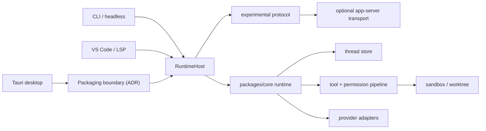

# DeepCode × Codex 整体改造计划

> 状态：已完成正反方审议，按仲裁结论执行<br>
> 基线：`main@38fcc3a`<br>
> 日期：2026-08-01<br>
> 决策原则：采用 Codex 已公开验证的产品与工程模式，但保留 DeepCode 的 DeepSeek 定位、品牌和向后兼容性。

## 1. 结论先行

DeepCode 当前已经不是一个“从零开始”的项目：核心工具、DeepSeek provider、会话、MCP、hooks、sandbox、skills、plugins、CLI、Tauri 桌面端和初步 IDE 接入均已存在，主分支也能完整通过构建与测试。

真正的问题是各界面在各自直接拼装 agent loop，导致协议、会话、权限、恢复、后台任务和 UI 状态逐渐分叉。继续按功能清单补齐只会扩大这种分叉。

因此本计划不以“继续复刻 Claude Code 菜单”为主线，而以 Codex 的三项核心设计为北星：

1. **统一运行时语义**：先让所有 host 使用不可绕过的 runtime factory，再把 Thread → Turn → Item/Event 固化成协议事实源。
2. **可信的长任务执行**：可恢复、可中断、可观察；worktree 只有在保留与冲突语义修复后才用于隔离并行写入。
3. **客户端薄、运行时厚**：CLI、桌面端、VS Code/LSP 不再各自复制 agent orchestration；具体是 in-process、sidecar 还是 daemon，必须由打包 spike 证明后决定。

首要架构决策调整为：先从 CLI 已验证的组装逻辑中提取 `RuntimeHost`，强制统一安全默认值、取消和配置加载；随后以实验 capability 建立最小协议，并在至少两个真实客户端使用后再冻结稳定面。`apps/server` 的 transport 与桌面打包方式不预设；不会立刻重写为 Rust，也不会一次性移除现有 API。

## 2. 调研依据

本计划基于 2026-08-01 刷新的 Codex 官方手册、官方开源仓库和 DeepCode 当前主分支，而不是基于记忆或旧截图。

主要官方参考：

- [Codex Best practices](https://learn.chatgpt.com/guides/best-practices.md)：计划优先、`AGENTS.md`、测试/审阅闭环、技能和长期任务。
- [Codex Subagents](https://learn.chatgpt.com/docs/agent-configuration/subagents.md)：主线程负责决策，子代理负责有界探索；写操作优先 worktree 隔离。
- [Codex App Server](https://learn.chatgpt.com/docs/app-server.md)：JSON-RPC、Thread/Turn/Item、审批、流式事件、恢复/分叉/中断/转向。
- [Codex Worktrees](https://learn.chatgpt.com/docs/environments/git-worktrees.md)：并行本地任务的隔离模型。
- [Codex code review](https://learn.chatgpt.com/docs/code-review.md)：以 diff 和可定位反馈为核心的审阅闭环。
- [Codex `AGENTS.md`](https://learn.chatgpt.com/docs/agent-configuration/agents-md)：仓库级持久指令和就近覆盖规则。
- [openai/codex](https://github.com/openai/codex)：官方开源实现；其 `codex-rs` 已将 protocol、app-server、core、thread-store、tools、sandbox、hooks、skills 和客户端拆成独立边界。

这里的“对齐”是设计原则与行为模型对齐，不是复制 OpenAI 的商标、文案、私有服务或逐像素克隆 UI。

## 3. 当前事实基线

### 3.1 验证结果

在 `main@38fcc3a` 上执行：

```bash
pnpm typecheck
pnpm lint
pnpm format:check
pnpm test
pnpm build
```

这些命令全部通过：

- 910 tests passed
- 12 tests skipped（真实 DeepSeek API、Linux bwrap/netns 等条件测试）
- 3 条 lint warning，无 error
- 当前根 TypeScript build 成功

这并不等于全仓覆盖完整：根 `tsconfig.json` 未引用 LSP/VS Code，`pnpm build` 不执行 Cargo check/test，VS Code 使用 `--passWithNoTests`，headless 测试也没有真实 agent E2E。README 的“549 tests”以及多份 handoff/milestone 状态已经明显过期，因此 PR 0 必须同时修正文档和 CI 覆盖。

### 3.2 已有优势

- `packages/core` 已具备较完整的 agent/tool/provider 基础。
- MCP、skills、plugins、hooks、sandbox、sessions、snapshots、worktree 均有实现与测试。
- CLI 已有 resume、background tasks、headless、voice 等可用行为。
- Tauri 桌面端已有 session sidebar、composer、inspector、file diff/history 等交互骨架。
- macOS/Linux 双平台 CI 与 release 工具链已存在。

### 3.3 关键差距

| 优先级 | 差距                                          | 当前证据                                                                                                               | 后果                                                                      |
| ------ | --------------------------------------------- | ---------------------------------------------------------------------------------------------------------------------- | ------------------------------------------------------------------------- |
| P0     | VS Code/LSP 可绕过中央门禁                    | `runAgent` 仅在 `opts.mode` 存在时调用 dispatcher；VS Code/LSP 注册完整工具却没有传 mode/permissions/sandbox           | Write/Bash 可在缺少统一审批和沙箱时执行                                   |
| P0     | 桌面 renderer 直接持有 provider 与 agent loop | `apps/desktop/src/lib/mac-agent.ts` 在 WebView 中创建 `DeepSeekProvider`，并明确缺少 hooks/session runtime/autoCompact | 凭证边界偏弱，运行时能力缺失，无法可靠后台执行                            |
| P0     | 中断语义不一致                                | desktop 有 `AbortController`；LSP `deepcode.abort` 只删除 id，没有中止实际 agent                                       | UI 显示“已停止”但任务仍可能继续写文件                                     |
| P0     | 桌面 runtime 打包方案未成立                   | Tauri app 未打包 Node/server sidecar，安装机也不能假设有 Node 22；core 依赖 Node API                                   | 不能直接宣称“Tauri 后端托管 TypeScript server”                            |
| P0     | 会话只是 message JSONL                        | `packages/core/src/sessions/storage.ts` 只存 `StoredMessage`，meta 与 events 分散                                      | 无法可靠表示未完成 turn、审批、tool item、fork、steer、parent/child agent |
| P0     | 权限与工具执行不是运行时统一能力              | 多个 host 自己决定传哪些 mode/permissions/hooks/sandbox 参数                                                           | 相同设置在不同界面产生不同行为                                            |
| P1     | 没有统一 Thread/Turn/Item 协议                | `packages/core/src/ipc/protocol.ts` 仍是窄 IPC map；CLI、desktop、LSP、VS Code 分别调用 `runAgent`                     | 行为、恢复、审批和事件格式持续分叉                                        |
| P1     | 桌面 fixture 未进入自动验收                   | 普通 Vite 入口依赖 Tauri 是预期行为；`preview-app.html` 可工作但没有视觉/交互 gate                                     | UI 改造缺少稳定、可自动化的验收入口                                       |
| P1     | CLI/desktop 大文件承担过多职责                | `commands.ts` 1344 行、`Repl.tsx` 1017 行、`repl.ts` 963 行、Tauri `commands.rs` 882 行                                | 修改成本高，难以建立可测试边界                                            |
| P1     | VS Code 与 LSP 仍是独立 MVP                   | VS Code 直接调用 core；LSP 仅支持 executeCommand 且 README 仍标注 TODO                                                 | 不能共享 thread history、审批、任务和配置                                 |
| P1     | 配置叙事仍以 Claude 兼容为中心                | README、BEHAVIOR_PARITY、settings JSON 都围绕 Claude parity                                                            | 新能力缺少稳定的 DeepCode 自身产品模型                                    |
| P1     | 文档真实性不足                                | README、HANDOFF、MORNING_REPORT、core README 相互矛盾                                                                  | 用户和后续 agent 会基于错误状态做决策                                     |
| P2     | 可观察性不足                                  | 没有统一 trace id、结构化运行日志、协议录制/回放                                                                       | 难以诊断跨客户端和长任务问题                                              |
| P1     | worktree 退出语义不安全                       | `removeWorktree` 强删 branch，但用户文案声称 branch 会保留                                                             | 并行写入可能丢失未合并工作                                                |

## 4. 目标产品模型

### 4.1 用户心智

- **Project**：一个工作目录及其持久配置。
- **Thread**：一个可恢复、可分叉、可归档的连续目标。
- **Turn**：用户的一次请求以及 agent 为此执行的完整工作；现有 `runAgent` 内部所谓 turn 改称 **Model Step**，不能直接投影成用户级 Turn。
- **Item**：turn 中可独立展示、持久化和审阅的单位，例如消息、命令、工具调用、文件变更、审批、计划更新。
- **Task/Agent**：thread 下的有界子工作；读任务可共享工作区，写任务在 worktree 安全语义完成后才默认隔离。

协议内部以这组术语为目标。原有 `session` 在兼容期映射为 `thread`，但首批 PR 不做全仓 UI 改名；等两个客户端消费新模型后再统一用户术语。

### 4.2 桌面端信息架构

桌面端不追求复制某一版 Codex 截图，而采用其稳定交互原则：

- 左栏：Projects / Threads，支持搜索、pin、archive、fork 和状态筛选。
- 中栏：Turn timeline。消息、plan、tool、command、file change、approval 都是结构化 item。
- 顶部：当前 project、branch/worktree、运行状态、model/effort、权限 profile。
- Composer：文本/图片/文件上下文、Plan/Default 模式、发送/interrupt；steer 先定义为“下一安全边界注入”或“取消后重启”，验证 provider 约束后再启用。
- 右栏：先收敛现有 Changes / Files / Inspector；Terminal / Agents / Context 后置到有真实数据源时。
- Diff review：先交付文件级 diff 与反馈回传；逐行反馈、单项 revert 和 review all 后置。
- 长任务状态：Planning / Running / Waiting approval / Waiting input / Blocked / Completed / Failed / Interrupted。

### 4.3 CLI 与 IDE

- CLI 保留终端优先体验，但内部成为 app-server 的一个客户端。
- VS Code 直接消费统一协议，不再自行创建 provider/agent loop。
- LSP 只保留真正的编辑器传输兼容；DeepCode 自有丰富事件走 app-server protocol，而不是伪装成 LSP command。
- headless/CI 继续提供稳定 JSON/JSONL 输出，并由协议事件投影生成。

## 5. 目标工程架构



### 5.1 `packages/protocol`

职责：

- 版本化 request/response/notification schema。
- `Thread`、`Turn`、`Item`、`Agent`、`Approval`、`Usage`、`Error` 类型。
- JSON Schema 与 TypeScript 类型生成入口。
- 协议兼容测试与录制/回放 fixtures。
- 不依赖 Node、Tauri、React 或具体 provider。

首批实验方法只覆盖一个垂直切片：

```text
initialize
thread/start
thread/read
thread/resume
turn/start
turn/interrupt
turn/completed              notification
item/started                notification
item/completed              notification
approval/requested          notification + approval/respond
user-input/requested        notification + user-input/respond
```

delta 默认只流式传输、不落盘。fork/archive/search、agent graph 等在垂直切片稳定后再加入。实验字段必须显式 capability 协商；至少由两个客户端消费并经过兼容测试后才升为 stable。

### 5.2 `RuntimeHost` 与 `apps/server`

职责：

- `RuntimeHost` 先统一 provider、tools、config、trust、permissions、hooks、MCP、sandbox 与取消的组装，且安全门禁不可选。
- `apps/server` 在桌面打包 ADR 后创建；JSONL stdio 只承诺单客户端 ownership 和完成后的跨客户端恢复。
- 若要多个客户端附着同一个 active turn，必须采用单 daemon + Unix socket/命名管道，并明确锁、订阅、背压与重连；不能把 stdio 当作共享 daemon。
- 初始化握手、client capabilities 与协议版本协商先保持 experimental。
- credentials、config、hooks、MCP、sandbox 等只在可信后端加载。
- graceful shutdown 与未完成 turn 恢复标记。
- renderer/webview 永远不直接读取 API key；VS Code extension host 属于可信进程，但也应通过统一 runtime 获取 credentials，而不是复制逻辑。

### 5.3 `packages/core`

保留现有可用模块，先建立不可绕过的 `RuntimeHost`，再把“一个 `runAgent(opts)` 函数”逐步重构为可恢复状态机：

- `AgentRuntime`：处理一个用户级 turn 的生命周期；内部 provider round-trip 为 model step。
- `ThreadRuntime`：维护 history、active turn、pending approvals、task graph。
- `ItemEmitter`：把 provider/tool/hook 事件规范化成协议 item。
- `RuntimeServices`：provider、tools、permissions、sessions、hooks、MCP、worktrees 的依赖容器。

当前 `turn_complete` 事件发生在工具执行前，语义其实是 model step complete；必须先更名/适配，不能直接公开为用户级 `turn/completed`。现有 `runAgent` 在迁移期作为兼容 facade 调用新 runtime。

### 5.4 持久化

采用 append-only rollout JSONL + 可重建索引：

- 每条记录有 `schemaVersion`、`sequence`、`timestamp`、`threadId`、`turnId?`、`itemId?`。
- message、tool、approval、file change、status、fork relation 都进入同一事件日志。
- metadata/index 允许 list/search/pin/archive，不作为完整事实源。
- 写入先临时文件/原子 rename 或单 writer queue，避免并发损坏。
- core 与 desktop 目前存在两种 legacy session 格式，且历史版本未完整写入所有 tool 事件。迁移采用格式探测、**双读单写**与 normalization；不修改旧文件，也不声称能恢复从未持久化的数据。

### 5.5 权限、工具与沙箱

统一顺序：

```text
model tool call
→ schema validation
→ mode/profile policy
→ repo/user allow-deny rules
→ hook preflight
→ approval request（如需）
→ sandbox/worktree execution
→ hook postflight
→ item persistence
→ client notification
```

原则：

- 默认 workspace-write + 网络受控；扩大边界必须可解释。
- 权限 profile 与批准策略分开，不能用一个 `mode` 同时表达两者。
- 写工具以 workspace/worktree 为边界；破坏性动作做目标解析和窄审批。
- 所有 host 使用同一 pipeline，禁止 renderer 或 IDE 绕过。

### 5.6 配置与指令

- `AGENTS.md` 成为首选跨 agent 仓库说明；继续读取 `DEEPCODE.md` 作为 DeepCode 专属兼容层。
- 继续使用现有多层 `settings.json` loader，暂不引入 TOML；先补逐 key provenance 与 deprecated/ignored diagnostics。
- 配置加载结果提供 provenance，UI 能解释某个值来自 user、project、local override 还是 CLI。
- 运行时公开 `config/read` 与 `config/diagnostics`，各客户端不自行合并配置。

## 6. 分阶段 PR 路线

每个 PR 都必须可独立构建、可回滚，并保持现有 CLI 主路径可用。默认创建 draft PR，验证充分后再转 ready。

### PR 0 — 事实基线与改造契约

- 新增本计划与审议记录。
- 新增精简 `AGENTS.md`，写明仓库结构、检查命令、完成标准和安全约束。
- 修正 README/核心文档中的测试数、技术栈、过期状态与“完整复刻”绝对表述。
- 增加 docs freshness 检查，至少验证关键数字来自测试报告或不再硬编码。
- 根 typecheck/build 纳入 LSP、VS Code；CI 增加 Cargo check/test，并让当前 coverage 缺口显式可见。

验收：文档互不矛盾；新 agent 可只读 `AGENTS.md` 完成 setup、test、review；CI 覆盖全部 workspace 与 Rust backend。

### PR 1 — 安全 RuntimeHost 与真实取消

- 从 CLI 组装提取 `RuntimeHost`，强制默认 mode、permissions、trust 与 sandbox；host 不能通过漏传 `mode` 绕过 dispatcher。
- CLI、headless、LSP、VS Code 先共享 factory；修复 LSP 假 abort。
- provider、pending approval、前台命令、Rust Bash 与 process group 真实取消；定义后台任务不随 turn 隐式存活的 ownership。
- 修复 worktree 退出强删 branch 与用户文案矛盾。

验收：启动延迟写文件的命令并取消，等待后目标文件仍不存在；所有 host 的 Write/Bash 都有一致门禁；worktree 退出不丢未合并工作。

### PR 2 — Legacy session 兼容层

- 探测 core `.meta.json + message JSONL` 与 desktop `session_meta + typed record JSONL`。
- 双读旧格式、单写 normalization 后的新格式；旧文件只读且不改字节。
- 增加截断尾行、中部损坏 diagnostics、并发 writer ownership 测试。

验收：两种旧格式可读；重启后顺序连续；中部损坏不静默；不虚构旧版本未保存的 tool history。

### PR 3 — 实验性 lifecycle 与协议

- 明确 User Turn 与 Model Step；修复当前 `turn_complete` 语义。
- 新建无 Node/Tauri/React/provider 依赖的实验 protocol package。
- 只实现 start/read/resume/interrupt 与 completed item 持久化；delta 不落盘。
- 日志、fixture 和 rollout 同期做敏感信息脱敏。

验收：lifecycle invariants、record/replay、重启恢复、terminal state 幂等和协议 golden tests。

### PR 4 — Desktop runtime packaging ADR/spike

- 已由 `docs/adr/0001-desktop-runtime-sidecar.md` 决定采用 Tauri 监督的 target-specific Node 22
  sidecar、单文件 app-server resource 与单客户端 stdio；不承诺 active turn 跨端附着。
- 可复现 probe 必须在无系统 Node 的 PATH 中证明协议握手，并报告 runtime 体积与冷启动。
- 签名、notarization、取消、升级和恢复仍是迁移 renderer 前的 release gate，不能用本地 ad-hoc
  签名冒充发布验证。

验收：形成 ADR、可复现 spike、本机构建体积/冷启动证据、发布签名 gate 和失败回滚路径。

### PR 5 — App-server 垂直切片与 CLI

- 按 ADR 创建 app-server/transport，实现实验 initialize、start/read/resume/interrupt。
- CLI 通过同一 handler/client 使用 RuntimeHost，保留外观与 headless JSON/JSONL 兼容。
- 明确单 owner、断线、背压、重连和 active turn 限制。

验收：CLI 原有行为不回退；新增 transport、断线、背压、中断和恢复 e2e。

### PR 6 — Desktop runtime migration

- 按 ADR 把 runtime 移出 renderer，移除 WebView 中的 provider/API key。
- 已建立可构建的 CJS app-server、target runtime、Rust supervisor 与 renderer protocol client；桌面
  chat 默认且唯一使用 sidecar，旧 `mac-agent`/`mac-tools` renderer runtime 已删除。
- app-server 已补齐按 active thread/turn 绑定的 approval、AskUserQuestion、tool 与 usage 事件；interrupt
  会解除所有待响应请求，避免 sidecar 因 UI 离线而悬挂。
- protocol snapshot 与 canonical session-v1 共享 id；新 thread 会进入现有 session 索引，旧 session
  在首次 resume 时惰性投影为 compatibility turn，避免桌面迁移形成第二套不可见历史。
- renderer 只能查询 credential presence/base URL，不能读取 API key/auth token；原生 mutation/bash
  commands 已从 Tauri invoke surface 移除，tool 执行统一经过 RuntimeHost。
- React 只消费协议事件；接入真实 interrupt、恢复与 structured items。
- `preview-app.html` 已使用官方 Tauri event mock 变成协议 fixture harness；Playwright CI 覆盖三栏
  几何、session resume、快速 turn、approval、tool/usage 完成事件以及 Files 的 Source/Diff/History。

验收：签名 app、凭证边界、Tauri IPC、重启恢复、浏览器 fixture 与视觉测试。

### PR 7 — VS Code 与 LSP 收敛

- VS Code 已改用 shared `ProtocolClient` + 独立 app-server bundle，删除重复 provider/runtime/credential
  组装；扩展 build 现在生成真实 `extension.cjs` 与 child bundle。
- LSP 已改为 shared `ProtocolClient` + 独立 app-server 子进程；不再读取凭证或组装
  `DeepSeekProvider`/`RuntimeHost`，并公开 read/resume/interrupt/approval/user-input 命令与原生事件。
- 两个编辑器入口均支持 canonical thread、structured tool items、approval、AskUserQuestion 与
  interrupt；VS Code diff context 继续由 agent 在 workspace 中读取，后续再接 `vscode.git` 优化。
- LSP 只承担编辑器兼容；VS Code 与 LSP 均已有真正协议测试，不再使用 `passWithNoTests`。

验收：完成后的 thread 可在 CLI、desktop、VS Code 间恢复；事件和权限语义一致。

### PR 8 — 配置、扩展、多代理与 review 收尾

- JSON config 已增加逐叶 JSON Pointer provenance 与不含值的 diagnostics；CLI/desktop/editor
  app-server 现在共享 core trust store，未信任项目不能通过 permissions/sandbox/env 等字段扩大权限。
- CLI doctor、Desktop About、VS Code command 与 LSP command 均消费同一个 diagnostics DTO，
  客户端不再自行解释配置来源或 trust gate。
- app-server 已在 host 内统一 `AGENTS.md`、`DEEPCODE.md`、rules、memory、user/project skills、
  output style、hooks 与 model/effort/mode defaults。
- MCP 与 plugin subprocess 已接入同一 turn-scoped lease：eager/deferred tools、resource refs、
  best-effort diagnostics、plugin capability policy gates 与 deterministic cleanup 共享 host 边界；
  plugin trust hash 覆盖全部安装文件，skills-only plugin 不再被强制启动进程。
- project/local command hook 已收敛到规范化定义哈希审核：未审阅或已变化的定义默认跳过，
  `deepcode hooks list|trust <hash...|--all>|revoke` 提供显式管理，diagnostics 暴露来源与审核状态；
  目录 trust 只是第一道门，user/explicit override 仍是可信层。
- app-server 已为 turn 生成稳定 `traceId` 并贯穿 durable/transient 事件；有界 NDJSON 只允许
  关联 ID、事件、状态码与耗时，不序列化协议 payload。`diagnostics/export` 与 CLI 共用脱敏器，
  路径哈希化、配置值/issue message 省略，导出前再次白名单清洗；删除 `logs/`/`diagnostics/`
  即可回滚，不影响 canonical thread。
- `workspace/diff` 已把 Git 工作区变化收敛成 app-server 拥有的有界 file/hunk/line DTO，并以
  canonical `threadId` 绑定 cwd；Git 不经 shell，未跟踪 symlink/binary 不读取内容。VS Code
  review、Desktop protocol agent 与 LSP command 共享该能力，不再各自解析 diff。
- 只读 `SubmitReviewFinding` tool 已把模型反馈持久化为含 path/line/priority/replacement 的
  `review_finding` item；`review/apply` 只接受 canonical thread 中已有 finding id，由 app-server
  解析原始 payload、生成单项或批量 prompt，并把 finding/action/turn 关联持久化为
  `review_action`。Apply 不暴露直写接口，因此继续经过 Edit/Write permission、approval、hook、
  sandbox 与 snapshot，客户端不能篡改 path/replacement 或伪造 finding。
- 每个 app-server turn 的文件快照已带 canonical turn id；`review/revert` 只解析已完成的 Apply
  action，并把 revert turn 的工具上限锁定为 `RestoreReviewAction`。该工具在任何写入前校验
  所有 current file 仍逐字节等于 Apply post-image、snapshot blob 完整且路径未逃逸；有冲突、
  Bash checkpoint 或 legacy 不完整快照时整体拒绝。恢复仍经过 permission/approval/hooks，且
  自身产生 pre/post 快照；新建文件可按 `existed=false` 安全删除。
- 在 worktree 语义安全后启用隔离写任务；sub-agent 深度维持安全上限，按真实需求扩展 agent graph。
- VS Code review all 与 latest-action revert 已由同一 canonical action path 提供，Desktop/LSP
  暴露对应协议能力；客户端内联评论/上下文 action 在有真实使用证据前继续后置，避免复制第二套
  finding/action 状态。
- 已删除无生产引用的 core renderer IPC、desktop native mutation/tool facade 与 `chat` 路由别名；
  Tauri 仅保留 credential presence、文件/快照只读投影和 sidecar supervision。legacy session importer
  继续只读，旧文件不迁移、不覆盖；用户文档已改为 app-server 架构。
- Tauri capability 已收紧为 open dialog、默认 URL、updater 与 restart 的精确 allow 集；未使用的 FS
  plugin、generic process exit、file reveal 和 renderer → provider CSP 路径已移除，release gate 防止回归。
- `pnpm release:check` 已对真实 VS Code/app-server/VSIX 产物执行包体预算、v1 capability、
  create/read、配置诊断、workspace diff、重启 read/resume 与薄客户端边界扫描；Ubuntu/macOS CI
  与 tag validate 共用该门禁，tag 还必须通过 desktop Playwright journey。迁移、隔离 home 回滚演练、
  fail-closed 协议升级和签名 DMG smoke test 已记录在 `docs/design/release-gates-v1.md`。

验收：端到端 golden journey、性能基线、安全 review、文档与 release gate。

## 7. 横向验收标准

### 7.1 行为

- 一个已完成或已中断的 thread 可以从 CLI 创建，在 desktop 恢复，再在 VS Code 继续；active turn 跨端附着取决于 daemon ADR。
- active turn 可以 interrupt，且中断后不再发生文件写入；steer 只有在安全边界语义经测试后才启用。
- 重启 server 后未完成 turn 有明确状态，不会伪装成完成。
- approval、ask-user、tool、file change 在所有客户端具有同一 id 和最终状态。

### 7.2 安全

- renderer/webview/VS Code webview 中不存在 provider credential。
- 所有写入与命令经过同一 permission pipeline。
- 日志、rollout、protocol fixture 默认脱敏凭证与敏感 header。
- 不可信 repo 不能通过配置/hooks/plugin 自动扩大权限。

### 7.3 质量

- 主分支不允许新增 `passWithNoTests` 的产品代码包。
- protocol/core/server 的公共行为必须有 contract 或 e2e test。
- CI 持续执行 typecheck、lint、format、test、build；关键安全测试按平台运行。
- 大文件目标：新增业务模块不超过 500 行；现有超大文件随触达拆分，不做无收益搬家。

### 7.4 性能

- release gate 以实测产物锁定 extension 64 KiB、app-server 768 KiB、VSIX 256 KiB 上限。
- 打包 app-server 冷启动 initialize 预算 5 秒，metadata request 2 秒，workspace diff 10 秒；报告随
  CI failure artifact 上传。提高预算必须附 before/after 数据和新增用户价值。
- thread list、长列表 UI 与 provider 首 token 仍需真实分布数据后再锁 SLO，不用本地单样本伪造目标。

## 8. 风险与缓解

| 风险                       | 缓解                                                                            |
| -------------------------- | ------------------------------------------------------------------------------- |
| 改造面过大导致长期分支     | 按安全 host → legacy 兼容 → 实验协议 → 打包 ADR → client 的顺序，小 PR          |
| 追逐 Codex 每周变化        | 只对齐稳定原则；协议做版本/capability；记录参考日期                             |
| UI 重做先于运行时导致返工  | 先确定 item/lifecycle，再重做 timeline 和 inspector                             |
| 旧用户配置/会话损坏        | 格式探测、旧文件只读、双读单写、明确回滚窗口                                    |
| 子代理并行写冲突           | 先修复 worktree 保留/恢复语义，再启用隔离写；合并前统一 review/test             |
| 桌面无法托管 Node runtime  | PR 4 在签名 app 和无系统 Node 环境做 sidecar/daemon spike，ADR 后才定 transport |
| 为“对齐”牺牲 DeepSeek 特性 | provider capability 由运行时发现；保留 DeepSeek cache、pricing、reasoner 特性   |
| PR 过多难审                | 每个 PR 有单一架构边界、明确依赖和可执行验收命令                                |

## 9. 决策规则

后续遇到未写明的选择，按以下顺序裁决：

1. 安全与数据可恢复性。
2. 跨客户端一致性。
3. 可测试、可观察、可回滚。
4. 用户完成任务的速度与清晰度。
5. 向后兼容。
6. 实现便利。

若 Codex 的公开行为与 DeepSeek/provider 约束冲突，保留统一产品心智，但允许底层实现不同；在 diagnostics 和文档中明确差异，不伪装完全兼容。

## 10. 审议与推进机制

本计划已完成一次正式正反方审议：

- 正方负责证明该架构能降低分叉、提升安全与长期交付速度。
- 反方负责寻找过度设计、迁移风险、错误优先级和可更小切入点。
- 仲裁只采纳有代码证据、测试证据或官方设计依据的观点。
- 审议结论写回本文件，并据此调整 PR 顺序和 scope。

审议完成后自动进入 PR 0 与 PR 1，不再等待逐项产品决策；只有凭证、付费、不可逆发布、破坏性数据迁移或权限扩大需要额外确认。

## 11. 审议记录

### 11.1 正方结论

正方支持“统一 runtime、Thread/Turn/Item、可信后端持有凭证、append-only 恢复模型”的主方向，证据是四个 host 虽共享 `runAgent`，但实际传入的 session、permissions、hooks、sandbox、autoCompact 和 task manager 完全不同。正方要求保留真实 interrupt、旧数据兼容和协议不变量，并建议先做最小 protocol/thread-store，不把 UI 或 transport 混入。

### 11.2 反方结论

反方认可收敛方向，但反对原 PR 顺序，关键证据如下：

- Tauri app 没有 Node sidecar，无法直接托管现有 TypeScript core/server。
- stdio 是一对一 transport，不能同时声称多客户端单 runtime owner。
- `runAgent` 的 dispatcher 因 `mode` 可选而可被 VS Code/LSP 绕过，安全修复不能排到后期。
- 现有 `turn_complete` 实际是 model step 事件，不能直接公开成用户级 turn lifecycle。
- core 与 desktop 有两种 legacy session 格式，一次性 importer 会固化数据缺失。
- worktree 退出会强删 branch，尚不能作为默认隔离承诺。
- 当前根 build/CI 未覆盖 LSP、VS Code 与 Cargo，910 tests 不能代表全仓完整基线。

### 11.3 仲裁决定

| 议题           | 决定                                                                            |
| -------------- | ------------------------------------------------------------------------------- |
| 总方向         | 保留统一 runtime 和 Thread/Turn/Item 北星                                       |
| 第一实现优先级 | 接受反方：CI 真实基线后立即修安全门禁、取消和 worktree 数据丢失                 |
| 协议           | 接受双方共同建议：最小 experimental slice，两个客户端验证后再 stable            |
| 桌面后端       | 接受反方：先做签名 app/无 Node 环境 packaging ADR，不预设 Tauri 承载 TS runtime |
| transport      | stdio 只承诺单客户端；active turn 多端共享必须 daemon/socket ADR                |
| 会话迁移       | 接受反方：双读单写、旧文件只读，不做一次性破坏迁移                              |
| 配置           | 接受反方：沿用 JSON loader 并补 provenance/diagnostics，TOML 后置               |
| UI             | 采用 Codex 的结构化工作流原则；术语换皮、Terminal/Agents 面板、逐行 review 后置 |
| 子代理         | 深度 1 视为当前安全限制，不把“加深层级”本身当目标                               |

此仲裁已反映到 PR 路线。后续若没有新的代码证据推翻这些事实，按本版本自动推进。
